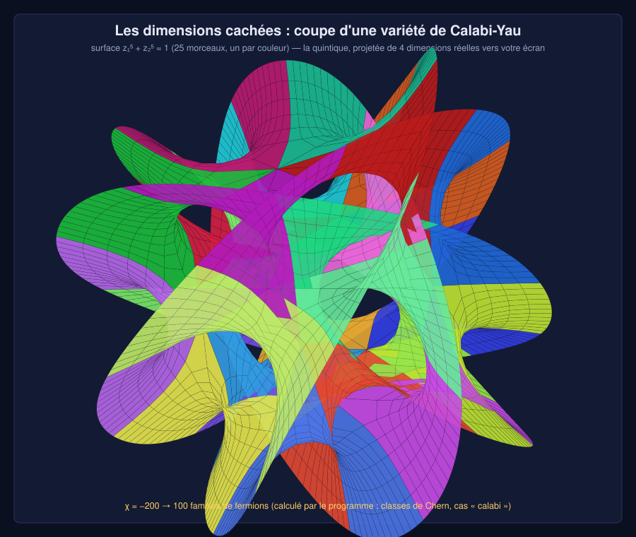
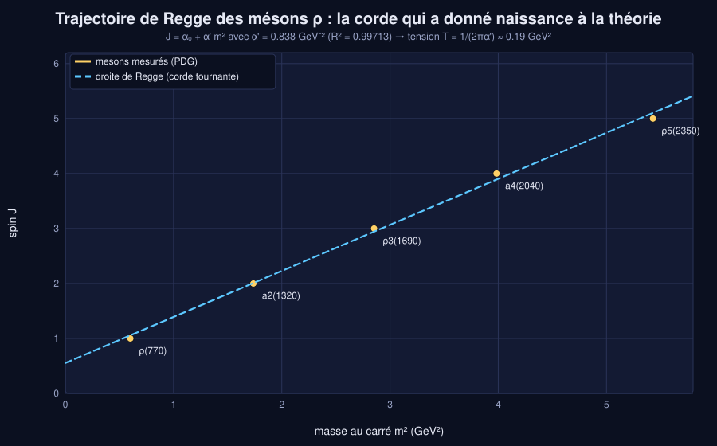
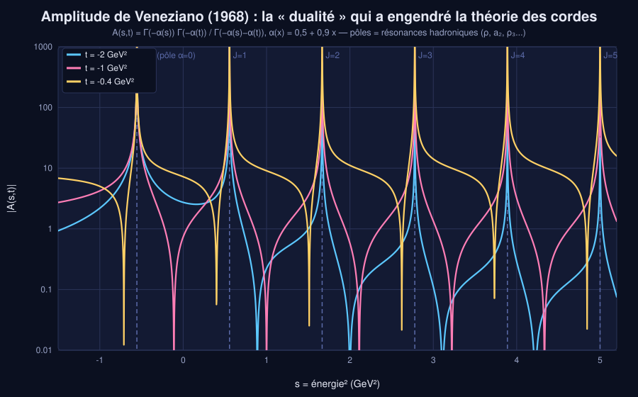
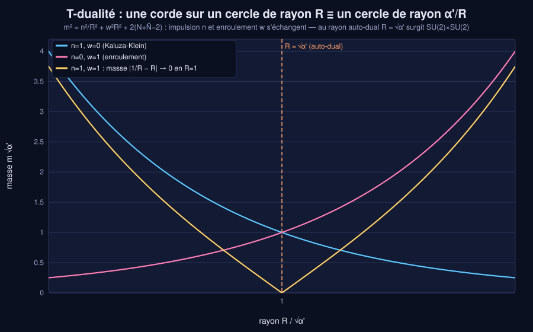
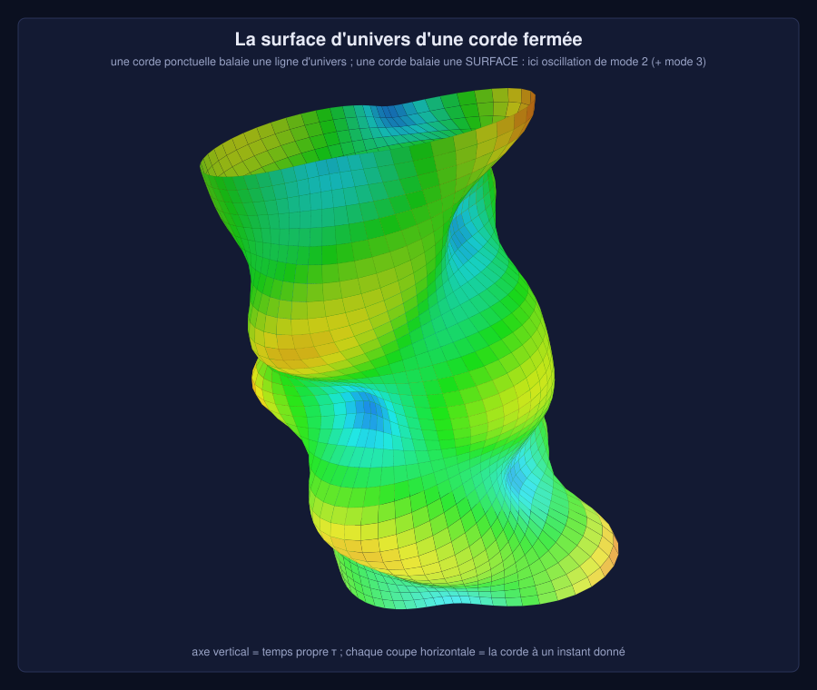

# 🎻 Le laboratoire des cordes

Un programme **C++17 sans aucune dépendance** pour explorer la théorie des cordes : cordes qui vibrent,
spectre quantique, dimensions cachées, dualités, **études de cas chiffrées**, **jeux** et
**18 illustrations SVG générées par le code lui-même**.

Le programme ne se contente pas d'affirmer : les résultats connus de la littérature (26 dimensions, χ = −200 pour
la quintique, 128 + 128 états au premier niveau massif de la supercorde, température de Hagedorn 4π…) sont
**recalculés** puis vérifiés par 39 auto-tests.



## Compilation et utilisation

```sh
g++ -std=c++17 -O2 string_theory.cpp -o string_theory      # ou : make
./string_theory                     # menu interactif
./string_theory --aide              # toutes les options
./string_theory --test              # 39 auto-tests
./string_theory --rapport figures   # rapport HTML + 18 SVG  (ouvrir figures/index.html)
```

```sh
./string_theory --liste                          # cas, jeux et figures disponibles
./string_theory --cas regge --cas calabi         # études de cas ciblées
./string_theory --tout --Ms=1000 --gs=0.3        # tout, avec vos valeurs physiques
./string_theory --jeu pincer --graine 42         # jeu reproductible
./string_theory --anim                           # animation ASCII de la corde
./string_theory --vue4d                          # corde fermée dans R⁴, rotation x-w
./string_theory --brut                           # coordonnées 4D brutes (format de la 1re version)
```

Paramètres physiques : `--Ms` (échelle de corde, GeV), `--gs` (couplage), `--R` (rayon en √α'), `--x0` (point de
pincement), `--Gmu` (tension cosmique), `--masse` (kg), `--lambda` (couplage de 't Hooft), `--n` (dimensions supplémentaires).

## 17 études de cas

| Cas | Ce que le programme calcule |
|-----|-----------------------------|
| `corde` | modes et énergie d'une corde pincée, simulation numérique de l'équation d'onde (énergie conservée à 10⁻¹⁴) |
| `spectre` | dégénérescences (1, 24, 324, 3200…), 576 = 299+276+1 (graviton, B, dilaton), supercorde 8/128/1152/7680 avec GSO et supersymétrie NS = R |
| `dimension` | pourquoi D = 26 et D = 10 : énergie de Casimir, régularisation 1+2+3+… = −1/12 |
| `regge` | droite de Regge des mésons ρ (données PDG), α' ≈ 0,84 GeV⁻², tension de la corde de QCD, corde tournante J = α'E² |
| `hagedorn` | l'entropie exacte tend vers 4π m√α' ; T_H = M_s/4π en GeV et en kelvins |
| `cercle` | T-dualité R ↔ α'/R, rayon auto-dual et enhancement SU(2)×SU(2) |
| `calabi` | classes de Chern de 8 Calabi-Yau : χ, générations, intersections — recoupés avec les nombres de Hodge |
| `dimensions` | grandes dimensions supplémentaires (ADD) : rayon selon M* et n |
| `trous_noirs` | Schwarzschild, Hawking, entropie, évaporation, transition corde ↔ trou noir |
| `cosmique` | corde cosmique : tension, déficit angulaire 8πGμ, lentille, durée de vie des boucles |
| `casimir` | pression de Casimir de 10 nm à 10 µm |
| `ads` | AdS/CFT : potentiel quark-antiquark, η/s = 1/4π, rayon d'AdS |
| `veneziano` | pôles de l'amplitude, signe de part et d'autre, symétrie s ↔ t |
| `planck` | de la corde de QCD à la corde de Planck (2πT = c⁴/G) |
| `lhc` | quelles résonances de Regge le LHC atteindrait selon M_s |
| `dualites` | T, S, théorie M pour vos valeurs de g_s et R |
| `atelier` | toutes les grandeurs dérivées de M_s et g_s (ℓ_s, T, T_H, rayon interne…) |

## Ludique 🎮

| Jeu | Principe |
|-----|----------|
| `quiz` | 20 questions dont les réponses numériques sont calculées par le programme |
| `accordeur` | trouvez les **deux** rayons donnant la même masse (T-dualité) |
| `pincer` | où pincer la corde pour éteindre une harmonique donnée ? |
| `univers` | choisissez un Calabi-Yau : saurez-vous trouver celui à 3 générations ? |
| `trous_noirs` | estimez la température de Hawking d'un trou noir de masse aléatoire |

## Les illustrations

Toutes sont écrites en SVG par `src/svg.hpp` (aucune bibliothèque graphique) : trajectoire de Regge, spectre,
Hagedorn, T-dualité, **surface de Calabi-Yau de Hanson**, amplitude de Veneziano, **surface d'univers**, trous noirs,
effet Casimir, AdS/CFT, carte des dualités, et une **corde animée** (SVG animé, à ouvrir dans un navigateur).

| | |
|---|---|
|  |  |
|  |  |

## Organisation du code

```
string_theory.cpp     menu, ligne de commande, rapport HTML
src/physique.hpp      constantes CODATA, conversions, formules (Hawking, Casimir, ADD, AdS/CFT…)
src/spectre.hpp       dénombrement d'états, GSO, D critique, Hagedorn, T-dualité, Regge, Veneziano
src/corde.hpp         équation d'onde, modes, corde dans R⁴, rendu ASCII
src/calabi.hpp        algèbre de Chern des intersections complètes, maillage de Hanson
src/svg.hpp           mini-bibliothèque de dessin (courbes, barres, surfaces 3D)
src/figures.hpp       les 18 illustrations
src/cas.hpp           les 17 études de cas
src/jeux.hpp          quiz, jeux, animation
src/tests.hpp         39 auto-tests
```

## Limites, en toute honnêteté

- Les formules « phénoménologiques » (ADD, correspondance corde-trou noir, échelle de Planck) sont données à des
  facteurs d'ordre 1 près, comme dans la littérature.
- Les masses des mésons sont des valeurs PDG arrondies ; les limites expérimentales citées sont indicatives.
- Ce n'est pas un calcul de théorie des cordes complet (pas de calcul d'amplitudes à boucles ni de stabilisation
  des modules) : c'est un laboratoire pédagogique où chaque résultat affiché est calculé et testé.
